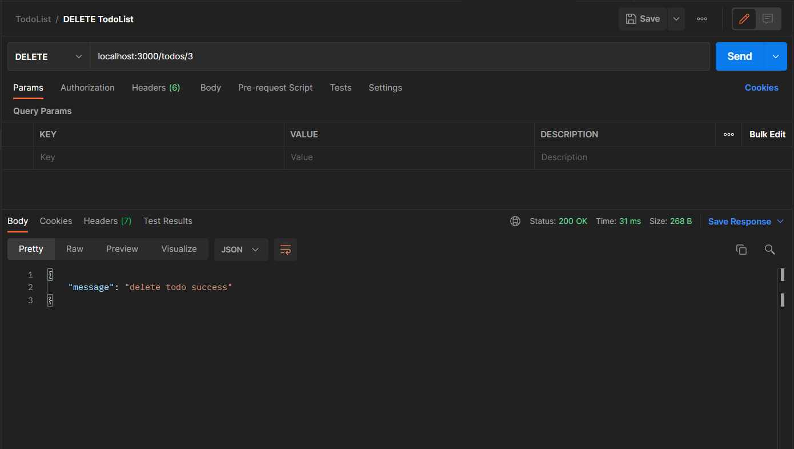

**Testing GET ALL (first time)**

**Testing GET BY ID**

**Testing POST**

**Testing UPDATE**

**Testing DELETE**

**Testing GET ALL (after all updates)**

**Documentation**

[Lihat disini](https://documenter.getpostman.com/view/18560650/UVR4MpbS)
